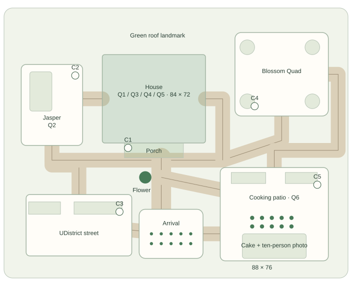
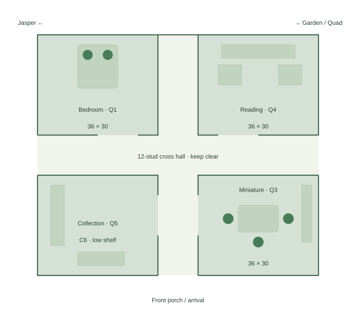

# Phuong’s Cozy World — map proposal v0.1

> Historical proposal. Superseded by [v0.2](map-proposal-v0.2.md): mobile is required, the house details one bedroom, and the street/Quad follow supplied photo references.

September 22, 2026 • Reviewable design only • **8–10 players confirmed**

## Intent and decision status

A little neighborhood wrapped around Phuong’s home: a shared arrival garden, a house slightly northwest of center, Jasper’s play yard to the west, a UDistrict-inspired street to the southwest, a blossom Quad to the northeast, and a cooking/birthday patio to the southeast. The same friends participate throughout. The house is the personal heart; the patio is the group gathering space.

**Confirmed:** Roblox, desktop/laptop first, rotatable third-person camera, 8–10 players (user reply in this task), real friends and boyfriend playing alongside Phuong, decoration/exploration focus, six established quest identities, approximately 30 minutes of main activities plus open social time. Preserve the personal details in the living design. This is not a recreation of her farm.

**Proposed:** Every dimension, exact layout, room arrangement, spawn revision, capacity per station, pacing allocation, camera tuning, decoration permission, and shared-progress rule below. One Roblox place with a physically connected house is recommended. The handmade-miniature art direction remains a recommendation, not final approval.

Source: [living design v0.4 snapshot](references/Phuongs-Cozy-World-Living-Design-v0.4.md), copied without alteration from `C:\Users\andre\Documents\Codex\2026-09-20\i-am-x20\outputs\Phuongs-Cozy-World-Living-Design.md`. Its bedroom wake-up opening and older NPC wording have not been silently edited. This proposal recommends a shared outdoor arrival instead; latest live-group and camera decisions govern conflicts. The original external document remains untouched.

## Labeled plans

These are spatial block plans, not finished art or surveyed Seattle geography. North is diagram-up only. Dimensions are provisional Roblox studs. Blocks include furnishing and activity space; final usable clearances must account for wall thickness.

## Neighborhood placement

Use a **280 × 220 stud** playable envelope, with a soft planted boundary. Coordinates below are design coordinates measured east and south from the northwest corner, not a required Studio axis convention. Do not build every empty patch as an activity.

| Zone | Northwest coordinate | Footprint | Use and group capacity |
|---|---|---|---|
| House | (80, 38) | 84 × 72 | Four activity rooms around a cross hall; whole group distributed among rooms |
| Front porch | (98, 110) | 48 × 12 | Welcoming threshold, no quest queue; front opening at x=122 |
| Jasper’s yard | (14, 46) | 50 × 66 | Q02; three contributors and nearby spectators; a clear fetch strip |
| UDistrict street | (18, 152) | 86 × 50 | Pedestrian lane and two shallow shopfronts; discoveries and decoration |
| UW-inspired Quad | (188, 20) | 76 × 68 | Blossoms, two benches, optional reading spot, relaxed conversation |
| Cooking/party patio | (176, 130) | 88 × 76 | Q06 plus cake; all 10 players fit without standing in the cooking lane |
| Arrival garden | (110, 164) | 52 × 40 | Ten separated spawn spots, welcome sign, view toward porch |
| Flower junction | around (128, 138) | 24 × 24 clearing | Shared six-petal landmark off the through-path; clear wayfinding |

Paths are **12 studs clear** on the main loop, widening to **16** at arrival, the porch approach, and patio entrances. Secondary discovery spurs are **8** and short enough to see their return path. Avoid stairs on the required route; use level thresholds or gentle ramps. Benches, tree trunks, flower beds, and signs sit outside these clear widths.

### Arrival and the route loop

All players first arrive in the south garden facing north toward the green house. Ten spawn positions use two staggered rows with approximately 8 studs between centers, outside the northward departure lane. A simple map sign names the house, Jasper, street, Quad, and patio; the flower is visible ahead. Late joiners use this same calm location and see the current shared state.

The recommended loop is **arrival → street → Jasper’s yard edge → porch → Quad → patio → arrival**. It is a navigation aid, not a required quest order. A clear connector from the porch east to the Quad passes south of the house. The Quad–patio connection follows the east-side garden. A central connection links the flower junction directly to the patio; players never need to go around the entire neighborhood to regroup.

The house has a front opening at (122, 110), a west side opening at (80, 74) toward Jasper, and an east side opening at (164, 74). The east path turns south along the outside of the house to the porch–Quad connector. These three openings meet the interior cross hall, so the house is an optional shortcut without routing traffic through someone’s bed or craft table.

The original optional snooze can remain a bedroom prop interaction discovered after arrival. Do not split Phuong from her friends or require a bedroom opening cinematic. This arrival change is a proposal for review.

### Landmarks and sightlines

- **Arrival:** porch roof and green front door form the main destination; the flower junction is in front of it. Keep the northward view free of tall hedges.
- **Porch:** tall blossom crowns identify the Quad to the right. A low fence and rabbit-toy basket identify Jasper to the left. Patio lanterns and the cake backdrop sit southeast.
- **Patio:** the tallest decoration is a modest birthday arch along the south edge, facing north into the gathering area. It remains recognizable from the central connector.
- **Street:** two facades create a neighborhood feel without extra interiors. A display window points toward collectibles; an optional small salon sign can reference her mom without adding a work quest.
- Keep hedges beside decision points around **3 studs high** and decorative canopies above **18 studs**, provisionally. Put tree trunks outside approach lanes; do not rely on foliage becoming transparent to make the map readable.

## House: generous miniature, not a crowded realistic house

One level; no stairs, bathroom, upstairs, or separate shop interiors in the first build. The four rooms are **36 × 30 studs** each, divided by a **12-stud cross hall**. Local coordinates start at the northwest house corner. Footprints are planning allocations; preserve the specified walking widths when walls are added.

| Room | Local rectangle | Furnishing and use |
|---|---|---|
| Bedroom, northwest | x=0–36, y=0–30 | Q01. Green-sheeted bed along the north wall; weighted dog and dinosaur with round bellies at the head; pillow/sheet tray on west side; small snooze clock |
| Reading nook, northeast | x=48–84, y=0–30 | Q04. Two reading seats, matcha-green 6-inch Basic Kindle, bookcase on the north wall, shared bookmark/display rail; east window toward blossoms |
| Living/collection room, southwest | x=0–36, y=42–72 | Q05. Collection shelf on west wall; separate staging ledge; small sofa and computer along south edge; no furniture in the room’s east opening |
| Craft room, southeast | x=48–84, y=42–72 | Q03. Central miniature table, three contribution edges, supply/color tray on east wall, completed miniature and optional coloring display on south wall |
| Cross hall | x=36–48 throughout; y=30–42 throughout | Front door opens into the north–south spine; side exits at the ends of the east–west hall. No interactable objects or storage in the hall |

Provide a **12-stud opening** from each room to the cross hall, without swinging doors. Bedroom and nook openings face the east–west hall; living and craft openings face the north–south spine. Exterior openings are also 12 studs wide and approximately 14 studs high. The room plan shows these gaps, not solid dividers that players would have to walk through.

Furniture is clustered against perimeter walls except the craft table. Reserve at least **8 studs behind active avatars** and a **10–12 stud passing lane** where traffic meets a station. Bed activities approach from three sides; the head stays against the wall. Craft-table contributors should not occupy the doorway. Keep figures and plushies small and personal; the generous room dimensions are for cameras and guests, not giant props.

There is no full indoor kitchen in the initial proposal. All cooking/prep happens outdoors under the patio canopy. A decorative tea tray is enough for the house until the six core spaces work.

## Six stations and simultaneous participation

Station capacities are design targets, not player restrictions. The group can split naturally; no station requires all 10 people to operate it at once, and nobody has to repeat every quest to qualify for cake.

| Quest | Station and simultaneous roles | Visible result / decoration opportunity |
|---|---|---|
| Q01 — Everything Tucked In | Bedroom; two sheet/pillow contributors and one finishing participant, with two watching positions away from the doorway | Made green bed; dog and dinosaur tucked in. Phuong can choose/approve pillow arrangement. Exact plush colors await references |
| Q02 — Jasper’s Favorite Things | Yard; one rabbit finder, one fetch thrower at a time, one Greenie giver; others pet/watch from the outer edge | Toy basket and a scrapbook moment. Provisionally reserve an 18 × 32 fetch lane pointing away from gates. Jasper is a fluffy golden-orange Pomeranian |
| Q03 — A Tiny World of Her Own | Craft room; three sides of one miniature reading-nook table, one supply/color participant; no single shared full-screen editor | Shared miniature lights up; Phuong chooses its finishing arrangement. Curated component slots and small color choices |
| Q04 — One More Chapter | Reading nook, optionally a Quad bench; two independent reading positions and two bookmark/display contributions | Each reader can annotate privately; one approved shared bookmark/nook decoration fills the quest’s petal. No reading quiz or synchronized reading. Exact completion rule remains proposed |
| Q05 — Little Treasures | Discoveries around the loop; two shelf placement spots and one staging ledge at home | Find three distinct figures, then arrange them on the shared shelf. Three more discoveries remain optional; no duplicate grind |
| Q06 — Something Delicious | Patio; two grill-side spots, two seafood-prep spots, two table-setting spots; remaining friends decorate or gather | KBBQ and seafood-boil dishes appear on the dining table; napkins, place settings, and centerpiece use curated slots |

Keep shared changes visible in the world. Proposed contention rule: temporarily reserve only the object/slot someone is using, not the whole station; release it on cancel or disconnect. Phuong can keep or revise personal finishing choices. The precise permission model is still open. Other players retain movement and their own camera when someone reads, cooks, or inspects a collectible.

## Collectible discovery plan

Six reachable discovery sockets; variants and the sixth figure are not assigned yet. Use the confirmed interests—Smiskis, Labubus, DUCKOOs, CryBaby Cheer Up, Nyota—when selecting final objects. Do not invent a preference for a specific variant.

| Socket | Hiding place | Discovery cue |
|---|---|---|
| C1 | Low porch planter, beside the return path | A figure peeks between leaves; visible on the way into the house |
| C2 | Yard toy cubby outside the fetch lane | Jasper can sniff toward it; never beneath a moving dog or a gate |
| C3 | Street display ledge | A gap in the display makes the figure readable from the sidewalk |
| C4 | Under a Quad bench, near its outside leg | Petal trail leads to the side; player can approach without entering the bench |
| C5 | Patio herb shelf beside prep | A small silhouette beside a pot, outside food interaction prompts |
| C6 | Living-room bookcase’s low side shelf | Visible while rotating the camera beside the collection display |

No required platforming, hidden interiors, tiny click targets, or collectible inside the miniature. A discovery is proposed to count once for the session and become available on the home staging ledge, so someone cannot strand progress in their inventory. Collected sockets retain a tiny decorative marker so late joiners understand what happened. No discovery close-up changes a bystander’s camera.

## Cooking, cake, wishes, and photos

The **88 × 76 patio** contains three bands, north to south:

1. **Cooking band, 20 studs deep:** grill west, seafood prep east, short ingredient return ledge, with a 12-stud service lane in front. An approximately 20-stud-high canopy covers only this band.
2. **Dining and circulation band, 20 studs deep:** finished-food table along the west edge, optional seats along the east edge, unobstructed center. Two wide entrances approach from west/central junction and north/Quad. Do not require chairs before cooking or cake can finish.
3. **Celebration band, 36 studs deep:** cake table and birthday arch against the south edge; a clear **52 × 24** gathering/photo area immediately north of them. Stage ten people in a shallow crescent or two staggered rows with about 7–8 studs between centers. Leave 12-stud side exits and a northward camera retreat.

Only after the six petals are complete does a proposed host control make the celebration available. The host waits for people, including reconnecting guests; no automatic warp or forced countdown. Invitation cues lead to the patio. Phuong gets the cake/wish interaction, while the actual friends deliver their own wishes. No generated dialogue for real guests.

A marked photo spot north of the gathering area looks south toward cake, avatars, and arch. An optional photo view is opt-in per player and exits immediately; otherwise players simply rotate their own camera. Keep the arch wide enough to frame two rows and prevent the cake from hiding faces. A rear step is optional only if testing shows it is needed, with level access retained around it.

Reserve a small gift stand east of the arch for the boyfriend’s note. **Note content is empty.** Do not generate, paraphrase, insert a sample, or substitute wishes for it. Its exact presentation can be chosen once his own text is supplied. All paths and activities stay available after cake.

## Camera and avatar clearance targets

These are proposed playtest starting points, not claims about Roblox defaults or tested constraints:

- Free rotation remains available indoors and outdoors. Try an elevated default pitch around **25–35 degrees** and a camera distance around **18–24 studs**, with an initial **10–30 stud** zoom range to evaluate.
- House walls approximately **18 studs high**; roof underside approximately **22 studs** above the floor. Use a simple roof shape with no low beams in activity spaces.
- First test an ordinary enclosed room at these dimensions. If roof/wall obstruction remains, plan local fading of the nearest obstructing wall/roof for the affected viewer. This must not hide the room for everyone or switch to a fixed dollhouse camera. No camera code is being implemented in this task.
- Optional close-ups belong only to the person choosing them, are cancelable, and restore that person’s prior view. Bystanders never lose their view or controls.
- Check the actual guests’ chosen avatar scales/accessories, two avatars passing through each doorway, and ten avatars gathering at cake. These dimensions are not a promise that every possible avatar fits.
- Avoid hanging lights in the camera’s orbit and tall opaque furniture between the door and station. Place window/roof detail after camera testing.

## Pace and social flow

Target a relaxed **about 30-minute** first session, not six timed chores. A plausible host-guided flow is 2 minutes arriving, 7 minutes sharing the bedroom/Jasper activities, 7 minutes crafts/reading/shelf discoveries, 6 minutes cooking and decorating, 3 minutes optional wandering and regrouping, and 5 minutes cake/wishes. This totals 30 minutes but is not a timer or enforced order.

With 8–10 contributors, parallel work could complete much faster. Preserve leisure through choices, discoveries, and seeing each other’s creations rather than padding travel or locking stations. Validate pacing with a group; the core may finish early and transition naturally into open social time. Reading, extra collectibles, decorating, and photos remain available afterward.

## Compact build priority plan — for later implementation

| Priority | Build scope | Review gate before adding detail |
|---|---|---|
| 1 — Space and camera | Graybox house cross hall, porch, loop, arrival, empty patio; use placeholder avatars | Ten participants fit at arrival/cake; two can pass in doorways; rotated indoor camera can see a station and companions |
| 2 — One personal room | Living/collection room plus a simple shared display prototype | Multiple players can contribute without blocking travel or moving each other’s cameras; shelf visible from more than one angle |
| 3 — Six destinations | Bedroom, craft table, nook, yard, patio counters; two street facades; three or four blossom trees | Every quest has a reachable station; routes work in either direction; missing optional discoveries never block cake |
| 4 — Personal detail and celebration | Plushies, rabbit/Greenie, Kindle, chosen figures, miniature, food, green decor, cake/photo staging | Group rehearsal: splitting up, regrouping, late join, reconnect, and host delay all make sense |
| 5 — Optional polish | Salon sign, coloring display, more shop/window detail, extra garden props | Add only after camera, group circulation, and the six favorite activities work |

Priorities describe future work, not authorization to implement or publish. For a beginner, reuse one simple furniture style, one path kit, one bench, and a small plant set. Spend unique modeling effort on the dog/dinosaur plushies, Jasper, miniature, collection shelf, and cake. Cut extra storefront depth, extra rooms, and elaborate animation before cutting those personal anchors.

## Review questions and limits

The guest count is now settled at **8–10**. The main remaining design choices are the proposed shared outdoor arrival, the roomy four-room house, and whether shared progress with Phuong’s finishing choices feels right. Exact avatar sizes, art approval, birthday deadline, cake appearance, collectible variants, book labels/reading status, note presentation, and host permissions remain open.

This proposal has been checked as a document and schematic, not playtested in Roblox. Camera feel, crowding, traversal time, and the 30-minute rhythm require a later graybox rehearsal. No gameplay, Studio project, asset uploads, publishing, or personal-note content is included.
