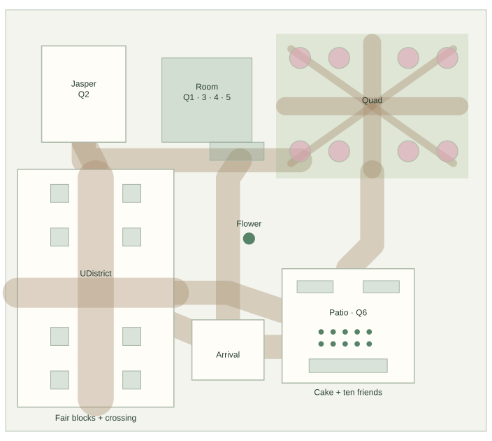
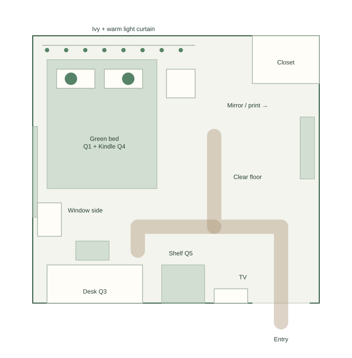
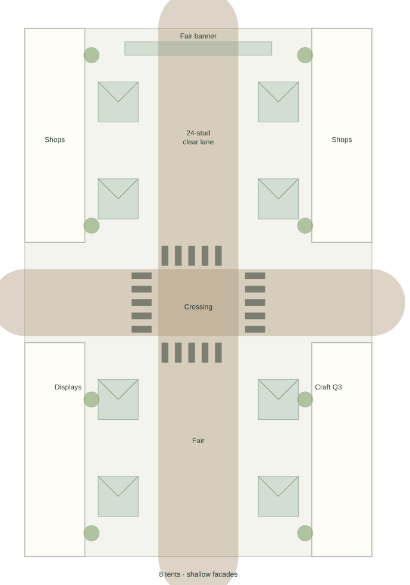
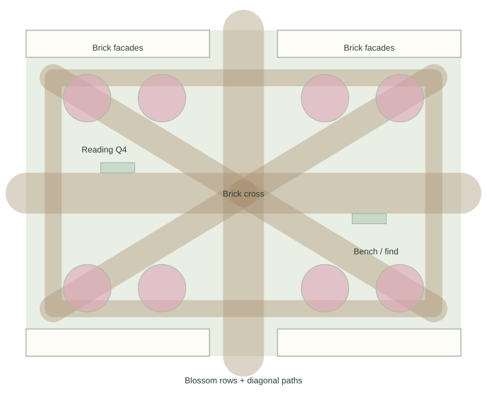

# Phuong’s Cozy World — map proposal v0.2

September 22, 2026 · 8–10 players · mobile, tablet, and desktop · design only

## Current decisions

**Approval update:** The user approved this plan in this task and requested dedicated tickets and rendered UI/color concepts, explicitly without code. The layout is the agreed planning baseline; approximate dimensions still require later testing. See [tickets](../tickets/README.md) and [visual concepts](visual-direction-v0.1.md). Approval of the plan does not claim that newly proposed palette/UI visuals have been approved.

This revision replaces v0.1 as the current map proposal. **Mobile-friendly play is now required**, alongside desktop. **The house interior will detail only Phuong’s bedroom**, using the two supplied room photos. The UDistrict street and UW Quad will be recognizable recreations of the supplied references, adapted into compact Roblox spaces. Rotatable third-person cameras and the real group playing together remain confirmed.

All dimensions, compressed distances, furniture sizing, crowd handling, touch interaction details, and exterior placement below remain proposals. The supplied photos establish appearance and relative placement, not measured dimensions. The street photos show a street-fair arrangement; using that event arrangement is the working interpretation for this revision. No exact present-day business roster or geographic north is inferred.

The earlier [v0.1 proposal](map-proposal-v0.1.md) and [living-design v0.4 snapshot](references/Phuongs-Cozy-World-Living-Design-v0.4.md) remain historical references. Their desktop-first/mobile-later wording and four-room house no longer apply. The external living document has not been changed.

## Reference interpretation

| Supplied images | Visible features to reproduce | Deliberate gameplay adaptation |
|---|---|---|
| 1–2: bedroom, opposite views | Sage-green bed and pillows; padded headboard; ivory walls; warm wood planks; hanging ivy and curtain fairy lights behind the headboard; white bedside table; closet beside headboard; botanical print and mirror; window and white curtains; white desk, display shelving, books, collectibles, wall TV and small cart | Enlarge walking space and camera headroom. Keep the furniture relationships; do not claim a surveyed reconstruction. A compact exterior leads directly into this room |
| 3: aerial street fair | Long straight pedestrian street, buildings on both sides, repeated tent edges, four-way intersection and striped crossings | Recreate one recognizable crossing plus short fair blocks, with a clear central lane and eight initial tents |
| 4–5: street close-ups | Overhead fair banner, varied low storefronts, projecting awnings, mature street trees, curved lamps, masonry corner buildings and a taller background silhouette | Use simple facade shells, a few distinct corners, one distant tower shape. Preserve the rhythm and recognizable forms; storefront text is a separate finishing pass |
| 6–7: Quad ground/aerial views | Broad central brick axis; perpendicular crossing; diagonal paths cutting lawns into triangles; blossom rows; brick collegiate buildings framing the edges | Keep the cross and diagonal geometry; use eight grouped blossom trees initially. Buildings are backdrop shells, not additional interiors |

The room views suggest the bed’s headboard/light wall is opposite the desk/shelf/TV wall, with the window along the desk side. The plan adopts this relationship. Closet depth, exact entry position, hidden wall lengths, and real-world scale remain inferred. Do not turn uncertainty into extra invented rooms.

Images are referenced by their upload numbers here. Original photos have not been added to the repository or published. The diagrams are new planning drawings derived from those references.

## Overall map

Provisional envelope: **320 × 280 studs**. Diagram-up is a design orientation only. Coordinates are east/south from the drawing’s upper-left corner. This enlarges v0.1 slightly to give the street and Quad their characteristic shapes while shrinking the house interior.

| Area | Northwest corner | Footprint | Connection |
|---|---|---|---|
| Bedroom house | (104,32) | 60 × 56 | South-facing door and 36 × 12 porch; direct approach from arrival |
| Jasper’s yard | (24,24) | 56 × 64 | West garden branch, north end of fair street |
| UDistrict fair | (8,106) | 104 × 158 | South arrival connection and north garden connection; crossing opens east toward the center |
| Quad | (180,16) | 128 × 96 | Southwest garden approach and south path to patio |
| Cooking/birthday patio | (184,172) | 88 × 76 | North from Quad; west from central junction/arrival |
| Shared arrival | (124,206) | 48 × 40 | House visible north; fair west; patio east |

Main route: **arrival → street crossing → fair north block → Jasper’s yard → house porch → Quad → patio → arrival**. The street’s south block is an optional short discovery spur, not required backtracking. Connect the crossing directly to the central junction, and the porch directly down to arrival. All six quests are available without a mandatory route order.

Maintain **16-stud main garden routes**, **12-stud secondary paths/door opening**, and **24-stud clear fair center**. Gentle, level transitions; no required jumps, narrow curb balancing, or stairs. Put the shared flower beside the central junction, not in its walking lane. Arrival has ten staggered spots; the birthday patio remains the space designed to gather all ten.

## One detailed room

Proposed **60 × 56 stud** interior allocation, walls around 18 studs high, ceiling/roof underside initially around 22. These deliberately generous game dimensions do not represent her room’s real measurements. No cross hall, separate craft room, separate library, or separate living room.

Local orientation for the plan:

- **Top/headboard wall:** green bed toward the left, ivy and warm curtain lights above it. Keep the weighted round-bellied dog and dinosaur at the pillows. Closet opening at the top-right, as a shallow visual recess with hanging clothes; no second navigable room.
- **Left/window side:** white curtain/window, low white storage and dog bed as space permits. Do not place props in the route around the foot of the bed.
- **Bottom/opposite wall:** white desk on the left, collection/book shelves next to it, wall TV toward the right, entry toward the far right. Desk contains the miniature and coloring supplies; a small computer can remain decorative.
- **Right wall:** botanical print and mirror; white bedside table sits beside the bed rather than blocking the entry. The original print is an appearance reference, not a requirement to reproduce tiny text.
- **Center/right floor:** reserve a continuous **12–16-stud circulation strip** between entry, bed, desk and shelf; **8 studs behind station users** where possible. Keep the desk chair tucked close to the desk and the cart at the wall.

The detailed room supports about **4–6 actively interacting players** comfortably as a target, with the rest exploring adjacent spaces. Everyone may enter; this is not a locked occupancy cap. It does not need to stage all ten around a single bed. If the birthday rehearsal crowds the room, move the group craft contribution to the outdoor booth, widen the circulation, or reduce props before enlarging everything further.

Camera proposal: start testing around 14–22 studs behind the avatar indoors; preserve free rotation, independent cameras, and straightforward touch orbit/zoom. These values replace the previous generic camera range as a test starting point, not a final setting. Test the real room shell first; use viewer-local obstruction fading only if needed. Do not change everyone’s camera when one person opens the Kindle.

Use a small number of warm lights plus simple glowing light strands; individual bulbs and leaves do not each need dynamic lighting or physics. The room should remain recognizable on lower visual settings through silhouette, placement, green bedding, wood, and the light curtain.

## UDistrict recreation block

Provisional **104 × 158**. Relative to its northwest corner, use a **24-stud central pedestrian street at x=40–64**, with **12-stud tent strips at x=22–34 and x=70–82**. The strips leave space between tents and the central route. Shallow facade/sidewalk bands occupy the outer edges. Two tents per side in each half give **eight tents total**.

The cross street spans the block around **y=72–92**, creating a 20-stud east–west route and recognizable four-corner intersection. Paint four sets of crossing stripes outside the central crossing so they read clearly from above. Keep all tents, cart handles, tree trunks, and signs out of the crossing. This is a pedestrian fair; no driving or traffic system is needed.

An overhead fair banner spans the street near the north end, high enough for the rotating camera. Use the reference’s banner placement without copying the old event date into the birthday world. Lamps, awnings, alternating facade widths, a masonry corner and small restaurant/shop signs create recognition. Confirm any must-have business names before polishing labels; no precise block identity is asserted from the photos alone.

Place an optional **shared craft booth** near the east side of the crossing, and a collectible display near the west side. The booth lets friends assemble contributions for the same Q03 miniature later displayed in Phuong’s room. It does not introduce a seventh quest. Other tents can be decorative: no shopping economy or separate minigame per stall.

Avoid reproducing the photo’s dense crowd of strangers. The real 8–10 players supply the moving crowd, with banners, stalls and ambient sound carrying the fair atmosphere. No NPC friend substitutes. Side entrances lead back to the neighborhood without teleporting to another session.

## Quad recreation block

Provisional **128 × 96**. Build the recognizable path pattern first: a **12-stud central north–south brick axis**, a **12-stud east–west crossing**, and **8-stud diagonal paths** from the four lawn corners toward the central intersection. Keep the diagonal paths distinct from the rectangular perimeter route.

Frame the north/south edges with simplified brick collegiate facades. Use blossom rows along those edges, leaving gaps over the central entrance axis. Start with **eight trees in clustered canopy shapes**; add density only after phone testing. Canopies should frame the paths rather than cover every camera angle; trunks remain outside the clear routes.

Two benches off the through-path provide a second Q04 reading location and a collectible hiding spot. Keep the central crossing open for social photos. Lisa can participate here as her real avatar if she joins; do not require an NPC cameo to complete anything. This is a compact recreation of the supplied Quad geometry, not a geographically accurate route from the fair to campus.

## Six quests in the revised spaces

| Quest | Main location | Mobile-friendly contribution proposal |
|---|---|---|
| Q01 Everything Tucked In | Bedroom bed | Tap sheet/pillow/plush choice, then tap a generous placement slot; Phuong can make the finishing choice |
| Q02 Jasper’s Favorite Things | Yard | Large rabbit/treat actions; tap-to-throw toward a suggested target, no precise swipe or moving-object hit required |
| Q03 A Tiny World of Her Own | Bedroom desk plus optional fair craft booth | Select part, select socket, confirm; same shared miniature, not duplicate progress |
| Q04 One More Chapter | Bedside Kindle or Quad bench | Large readable text panel, tap sentence/phrase to highlight, choose a reaction; optional typed note, no required mobile keyboard |
| Q05 Little Treasures | Six discoveries and bedroom shelf | Approach-and-tap pickup, select shelf slot; no tiny direct tapping on figure meshes |
| Q06 Something Delicious | Cooking patio | Separate grill, seafood and table-setting positions; forgiving tap actions, no precision dragging or fast timing |

Keep six discovery sockets: porch planter, Jasper toy basket, street display, Quad bench, patio herb shelf, and low bedroom shelf. Three distinct discoveries remain the proposed Q05 requirement; other three are optional. Shared session completion and Phuong’s personal finishing choices remain proposals. Reserving one currently used slot should not lock a whole station; release reservations on cancel/disconnect. Late joiners see current progress and can help immediately.

The patio retains separate cooking and cake/photo areas from v0.1: ten-person shallow crescent or staggered rows, 52 × 24 clear gathering space, and two open approaches. Host-triggered gathering after six petals is still proposed; no automatic warp. Friends supply their wishes. **The boyfriend’s note content remains empty and user-authored only.**

## Mobile is a design requirement

Roblox’s guidance calls for adapting to the player’s input/display and reserving space for built-in touch controls. See [adaptive design](https://create.roblox.com/docs/production/publishing/adaptive-design) and [UI positioning and mobile control zones](https://create.roblox.com/docs/ui/position-and-size). The following are project proposals derived from that guidance:

- All six quests, decorating, journal, cake and dismissal/back actions must work with touch. Keyboard shortcuts remain optional conveniences on desktop.
- Prefer standard Roblox movement/camera behavior and a contextual, generously sized action button. Do not cover the movement thumb area, jump control, screen cutouts, or the view needed for camera rotation.
- Use tap-select → tap-slot → confirm for decoration. Dragging can be optional; never require hover, right-click, tiny precise taps, or several simultaneous fingers.
- Offer compact panels on phones with clear close/back controls, generous spacing and readable text. Start touch targets around 48 screen-space units, then judge their physical size on devices; this is a design target, not a Roblox platform minimum.
- Propose landscape as the primary phone layout; final orientation behavior remains to be set. Tablet and desktop layouts should use their extra room without shrinking phone controls. Handle the on-screen keyboard without covering the active field.
- Reduce tiny clutter, transparent leaf layers, lights, particles, high-detail storefronts, and distant geometry before sacrificing the reference landmarks. Reuse tents, lamps, shelves and tree shapes.
- Validate input and screen layouts in Studio’s [Device Simulator](https://create.roblox.com/docs/studio/device-simulator), then run the actual group scene on a representative phone/tablet and laptop. Simulation alone does not establish real-device comfort or performance.

No specific phone is assumed. Select the lowest-spec intended guest device before final performance budgets. A proposed initial target is stable 30 fps there during ten-avatar cake and street scenes, with no overheating or memory instability in a 30-minute rehearsal; this is not a measured result.

## Build order and review gates

1. **One room and touch interaction:** room shell, green bed, desk/shelf blocks, doorway and camera. Test movement, touch orbit and one placement interaction on phone and desktop before detailed decoration.
2. **Reference geometry:** graybox the fair’s long lane and crossing, and the Quad’s cross/diagonals. Connect both to arrival, yard, house and patio. Confirm sightlines and return routes.
3. **Shared activity footprint:** place all six stations and ten placeholder avatars. Test the room with 4–6 active participants, outside contributions, late joining and ten-person cake gathering.
4. **Recognizable details:** ivy/lights, plushies, desk displays, banner, tent/awning rhythm, masonry facades, brick paths and blossom rows. Keep exterior businesses and campus buildings shallow.
5. **Full rehearsal:** mixed mobile/desktop group, independent cameras, visible shared decoration, optional reading, rejoin, host delay, cake/photos, and approximately 30-minute relaxed pacing. Do not pad parallel completion with timers.

No gameplay implementation or publishing is included in this revision. Still to confirm later: target phones, desired street-fair versus everyday street appearance if different from these references, any must-have shops, concealed room details, exact collectible variants/book labels, cake styling and host permissions. These do not block this concrete map proposal.
