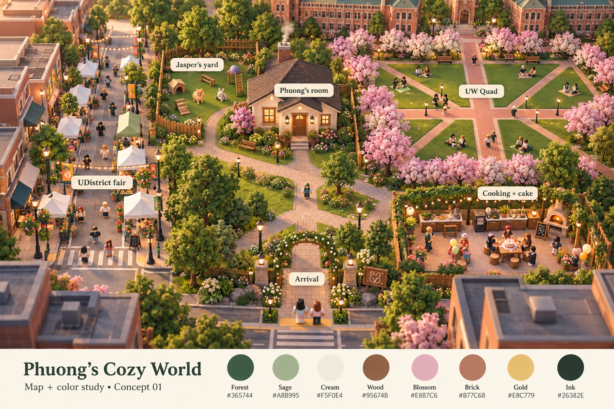
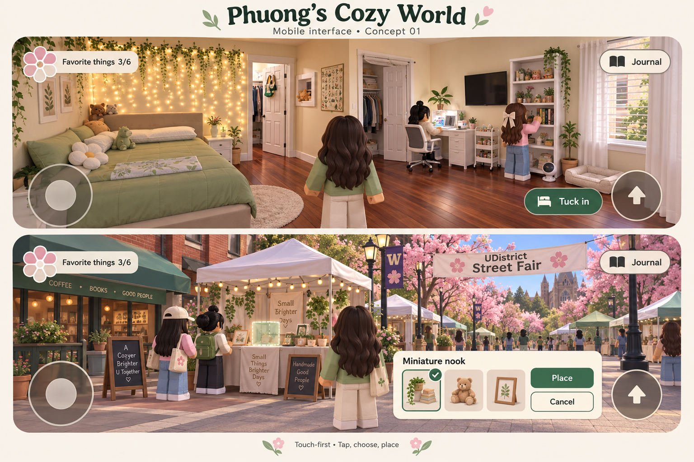

# Phuong’s Cozy World — visual direction and UI concepts

**Status:** Proposed visual treatment of the approved map v0.2. The user approved the plan and requested tickets and rendered concepts with no code. Palette, exact UI composition and styling below are new proposals. No working UI or Roblox implementation is included.

## Rendered concepts

These images communicate atmosphere, shapes, colors and screen composition. The [map specification](map-proposal-v0.2.md) and dimensioned diagrams govern geometry if illustrative details differ. Generic avatars represent guests; their appearances are not approved likenesses. The cutaway/overhead view is an art-direction view, not a replacement for the confirmed rotatable third-person gameplay camera.

### Review notes on these renders

The palette labels and the exploration/placement actions are readable, and the room's green bedding, ivy lights, white furnishings and wood floor are recognizable. The illustrated scenes are denser than the intended first build: pictured extra visitors are not a request for NPC crowds; start with the actual 8–10 players, eight tents and eight Quad trees. Use level/ramped access where the illustration shows steps. The patio's decorative oven is not an added activity. The four-way fair crossing must follow the plan even where the illustration obscures it.

The room rendering combines reference features artistically; its additional closet-like opening and furniture orientation are not approved alterations to the photo-based plan. Keep one closet recess beside the headboard and the desk/shelf wall opposite the bed wall. Final UI work must also check the flower's exact six-petal construction and reserved touch-control spacing rather than copying raster artwork as a finished interface.

## Proposed palette

Hex values here are the source of truth; lighting and image generation may shift displayed swatches.

| Name | Hex | Use |
|---|---|---|
| Forest | #365744 | Primary action backgrounds, house/wayfinding accents, selected emphasis |
| Sage | #A8B995 | Green bedding, soft furnishings, planters, secondary surfaces |
| Cream | #F5F0E4 | Room walls, white-painted furniture warmth, opaque interface panels, text on forest |
| Wood | #95674B | Warm bedroom flooring, craft and table surfaces |
| Blossom | #E8B7C6 | Cherry blossoms and small celebratory accents |
| Brick | #B77C68 | Quad paths, masonry storefront accents |
| Gold | #E8C779 | Curtain-light warmth, small completion details |
| Ink | #26382E | Primary text and clear dark outlines on pale surfaces |

Use Ink on Cream for ordinary text and Cream on Forest for primary actions. Avoid pale text on sage/pink/gold, or relying on green alone for selected/completed state. Selection includes an outline and check; completion also uses a count and label. Contrast and real-device readability remain validation work, not a claim established by the images.

## Materials and detail budget

Rounded, simple 3D furnishings with painted surfaces and restrained texture. Personal detail concentrates on the bed/plushies, ivy lights, miniature, shelf, Jasper, and cake. Street identity comes from the long lane, crossing, tent/awning rhythm, varied masonry corners and banner. Quad identity comes from brick axes and diagonals, triangular lawns, blossom rows and brick facade framing.

Use quiet cream panels and green actions so UI feels related to her room. Keep flowers and gold as accents. Do not add rustic farm machinery or a large farm to achieve coziness. Shop/campus facades remain shallow; closet remains a recess. Decorative density should leave walking routes and mobile camera views open.

## Screen and interaction plan

| State | Visible elements | Action and exit |
|---|---|---|
| Explore | Small six-petal flower/count; Journal; one nearby contextual action; built-in movement/jump zones | Touch action or desktop equivalent; central view stays available for camera rotation |
| Select decoration | Compact panel with a few large choices, clear selected state and a visible world socket | Select item → select slot → Place; Cancel restores exploration without committing |
| Slot in use | Local slot indicator and short label | Choose a different slot or wait; no whole-station lock |
| Placement committed | World object changes visibly; subtle confirmation | Return to exploration; later replacement follows Phuong/host permissions |
| Journal | Six named activities, completed count, location hints | Close/back always available; no pressure timer or requirement that everyone repeat everything |
| Reading | Readable text, generous highlight choices, reaction/bookmark action | No compulsory typing; optional note field handles keyboard space; close preserves partial work |
| Gathering | Optional patio invitation and host-controlled timing | Walk there; no forced warp or camera. Cake action belongs to Phuong |
| Photo | Voluntary per-player viewpoint, explicit exit | Restore that player's camera only |

The two rendered phone screens illustrate exploration and placement; remaining states are specified for PCW-02, not falsely represented as completed screens. Desktop should keep the same labels and state rules, substitute input hints where helpful, and avoid displaying a touch joystick. Tablet can use extra width without shrinking tap targets. Phone orientation remains a landscape-first proposal; portrait behavior needs a later decision.

Aim for approximately 48 screen-space-unit touch targets as an initial design target, with separation between Place, Cancel, jump, and movement. Reserve cutout/inset space and camera-drag area. Actual control placement must be tested with Roblox controls, not judged solely from these illustrative screens.

## Scope and handoff

[Sixteen dedicated local tickets](../tickets/README.md) separate art, UI, map, environments, activities, shared behavior, celebration, content and QA. This delivery contains Markdown planning and generated raster concepts only. Existing schematic files are retained; no new scripts, HTML, Luau, or gameplay code are written for this task.

The birthday note stays empty until the boyfriend supplies it. No sample letter or fictional guest message is part of these concepts.

Generation: built-in image-generation tool. Exact prompts and reference roles are recorded in [generation-prompts.md](concepts/generation-prompts.md). Images are concept proposals and may contain illustrative deviations; use the map specification for build dimensions.
