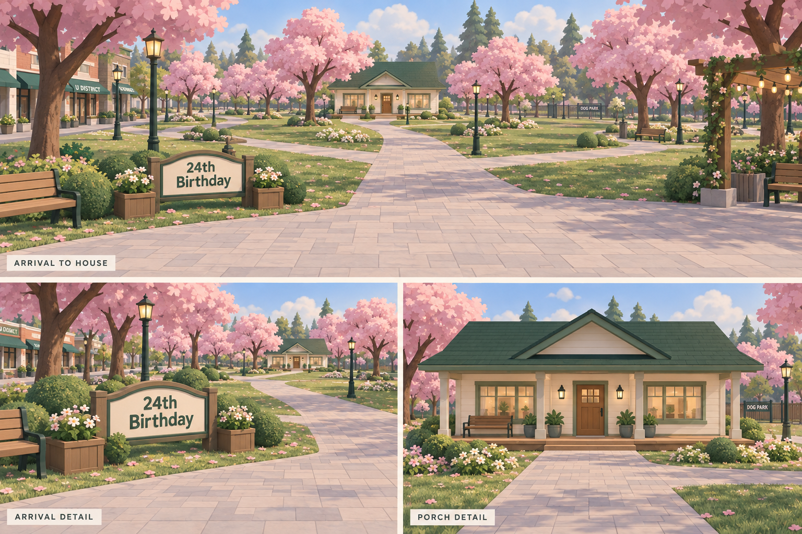

# Arrival to house — visual study 01

September 26, 2026 · Accepted visual direction for the first draft

The first Studio implementation and its actual screenshots are recorded in [Draft 01](roblox-draft01.md).

This study refines C01 lighting, C02 paths, C03 house exterior, and C09 arrival from the [component designs](roblox-component-designs.md). The approved geography remains unchanged. The board is generated concept art, not a Roblox screenshot or a rendering of the shortlisted community assets. Its perspective establishes appearance; the component plan remains the source for proposed dimensions.

## The first view

The composition has three anchors: the low birthday sign in the left foreground, the pale path leading through the middle ground, and the cottage's green roof and front door beyond. The sign welcomes the group while leaving the right half of the plaza open. The cottage is the destination the eye returns to after noticing the blossoms and side paths.

Keep the central opening in the canopy. Trees frame the house from the sides rather than hiding it behind a solid pink tunnel. Streetfronts at the far left, the courtyard at the near right, and the park beside the house give context without becoming competing focal points. Camera rotation remains independent for each player; this is the proposed initial direction, not a locked camera.

## Arrival treatment

- **Sign:** a shallow curved cream face in a sage/dark-green frame, supported by two warm-wood posts. The concept uses only “24th Birthday.” This is proposed welcome-sign styling; it is separate from the user's personal note.
- **Placement:** keep the sign near local `(-30, 0)` in the arrival plot, west of the paved group pad. Its roughly 24-stud width is a blockout target, not a measurement taken from this image.
- **Planting:** two matching wooden planters frame the sign. Low pale flowers and rounded shrubs soften its base. Keep planting beneath the lettering rather than in front of it.
- **Seating:** one wood bench west of the sign, set back far enough that seated guests do not occupy the group pad.
- **Gathering:** preserve the proposed 56 × 32 paved pad and eight arrival positions. Use ordinary paving throughout; visible numbered spawn pads would detract from the welcome.

The plaza should feel complete with only these few objects. Small decorative additions come after checking the open gathering space with avatars.

## The blossom approach

Use pale warm-gray paving with large, subtle joints and minimal edging. The main promenade stays approximately 12 studs clear; branches stay around 8. Its shallow curves draw attention north without forcing the player into a winding route. Preserve the named route endpoints and the three western/two park/two courtyard connections in the component plan; not every junction is visible in this perspective.

The continuous lawn remains visible on both sides of every branch. Set tree trunks, shrubs, lamps, and benches outside the clear route widths. Broader tree groups belong near the edges and in the larger lawn pockets. Keep the inside of junctions open so players can see where each branch goes.

Use one lamp design: a simple dark-green post and a small warm lantern. Repeat it sparingly at arrival, a central choice point, and the house approach rather than making a dense avenue of lights. Benches belong in side bays. Petals can lightly scatter near the trees; paving must remain readable.

The illustration uses rich flower and leaf detail to convey mood. For Roblox, begin with a few reusable foliage meshes and simplified ground patches, then judge density from the actual player camera. Do not treat every illustrated leaf or blossom as a separate object to reproduce.

## Cottage facade and porch

The proposed facade uses warm cream walls, a forest-green main roof, sage edging, warm wood door and porch, and two broad front windows. A shallow front gable gives the entrance a distinct silhouette while keeping the overall cottage one story. This small gable is a new visual proposal, not a change to the building envelope.

Keep the main roof planes broad and quiet. Add restrained warm light inside the windows and two small lamps beside the door. The bench sits on the west side of the porch. A matched planter pair near the doorway and a second outer pair can frame the facade if the entry remains clear; the outer pair is optional.

Continue the main approach to the porch's eastern side, then turn gently toward the door. The blockout still targets an 8 × 12 doorway, a 56 × 16 porch, and a 64 × 48 shell. The illustration's small porch lip should become a flush or smoothly ramped walking connection in the playable version. Preserve a route past anyone standing at the door.

## Shared material treatment

| Material family | Proposed appearance | Used on |
|---|---|---|
| Cream | Warm, matte, lightly shaded | House walls, sign face |
| Forest green | Deep enough to frame lighter surfaces | Roof, sign border, lamp posts |
| Sage | Soft muted green | Trim, shrubs, selected accents |
| Warm wood | Restrained grain, broad boards | Door, porch, bench slats, planters |
| Paving | Pale warm gray, subtle large joints | Arrival, promenade, branches |
| Blossom pink | Dusty pink with a few lighter patches | Shared cherry-tree canopy family |

Keep one soft afternoon lighting setup. The roof and front door need clear contrast against the blossoms; avoid heavy bloom, thick fog, or an orange cast across every material.

## Asset choices this visual will help us judge

Use the [existing candidate register](roblox-asset-register.md); no candidate advances to adopted on the strength of this generated image.

- The cottage candidate needs a usable interior and comparable broad proportions. A simple native shell may match this facade more easily than heavily altering a prebuilt house.
- The blossom candidate needs a clear trunk, high canopy, and compatible soft silhouette. Inspect it from the ground as well as above.
- Street-kit benches and lamps can be recolored and repeated only if their proportions fit this quieter cottage setting.
- Paving, planters, and the birthday sign can begin as simple native parts. The sign face can use native text; the image is a reference, not a texture to stretch over the whole entrance.
- Keep the sky shortlist for a side-by-side lighting comparison during the asset-review phase.

No new external mesh is required to test this first view. Assets used for the playable map will be selected and inspected separately.

## Checks before accepting the treatment

1. From each of the eight proposed arrival positions, the sign and northbound route are understandable and the cottage roof is visible.
2. Walking north, the doorway remains discoverable through the tree groups. Check this at ordinary third-person height, not only from a raised presentation camera.
3. Turning toward a side path reveals its destination; lamps and shrubs do not conceal the junction.
4. Two players can pass at the porch while others wait near the bench or planters.
5. The same wall, wood, paving, and tree samples look compatible under the chosen lighting.

**Status:** user accepted the visual direction on September 26, 2026 and requested assets for building it. The [arrival asset shortlist](roblox-asset-register.md#arrival-to-house-shortlist--september-26) records live free listings, thumbnail findings, and the proposed native parts. Exact dimensions and individual models still need validation. No Studio construction, imports, scale tests, or multiplayer testing performed for this study.

Generated using the built-in image-generation tool. The [complete generation prompt](../art/references/map/arrival-to-house-concept-v1.prompt.md) is saved with the image for later revisions.
