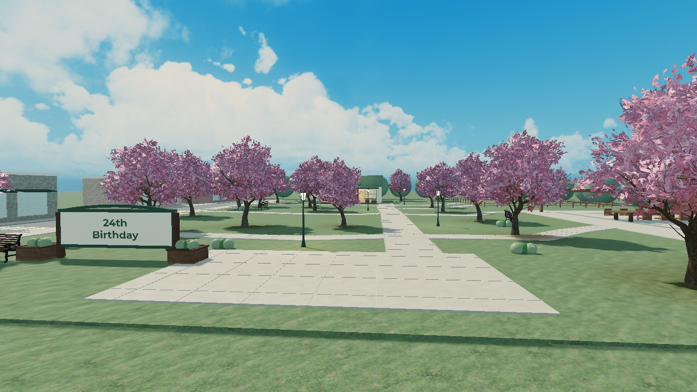
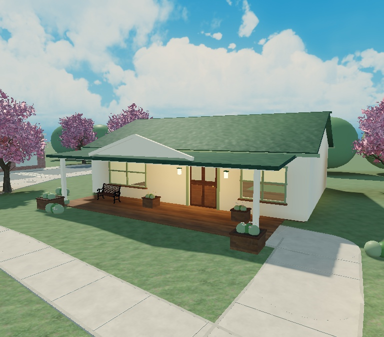

# Roblox map — Draft 01

September 26, 2026. First editable environment draft, following the approved arrival-to-house concept and the user's authorization to build in Place1.

Open the [working place](../roblox/phuong-cozy-game.rbxl) or preserved [Draft 01 checkpoint](../roblox/Phuong-Cozy-World-Draft01.rbxl) in Studio and press Play to explore. Movement and the third-person camera use the normal Roblox controls. Press **E** near the cottage door to open or close it.

**Local save verified:** the user saved `roblox/phuong-cozy-game.rbxl`. A separate `roblox/Phuong-Cozy-World-Draft01.rbxl` checkpoint preserves this first version. Both are 630,601 bytes, have the Roblox binary header, and have identical SHA-256 hashes. Screenshots, source records, and notes are also saved in the repository. The place has not been published.

## Built in this draft

- South arrival plaza, hidden group spawn, two-sided **24th Birthday** sign, planters, and bench.
- Continuous green Quad underneath the overlaid main path and side connections. Main route is 12 studs wide; side paths are 8.
- Twenty-three community blossom trees, restrained fallen-petal accents, benches, and warm lanterns.
- Cream cottage with a forest-green roof, porch, windows, an operable front door, and an enterable interior shell.
- Western street and three simple storefront masses; northeastern dog-park fence; southeastern birthday courtyard outline with a table and eight seats.
- A shared afternoon sky and warm lighting setup.

The house shell is 64 × 48 studs centered at X -28, Z -108. During assembly, the front door moved to **X -20, Z -84**, with the 56 × 16 porch centered at X -28, Z -76. This supersedes the earlier door-coordinate proposal. The route bends onto the porch from the east.

## Review images

These are captures of the actual Roblox draft, not the earlier generated concept illustration.

## Assets and authoring

Five free Creator Store listings supplied the blossom tree, lamp, bench, sky, and petal accent. See the [asset register](roblox-asset-register.md) for IDs, creators, and inspection notes. Buildings, paths, sign, planters, and context geometry use editable native Roblox parts. No external 3D file import was needed.

The active environment is grouped in `Workspace.CozyWorld_Draft01`. Reviewed reusable templates are in `ServerStorage.CozyDraftAssets.Reviewed`; original imports are in `Incoming`. The original spawn, loose Part, baseplate clone, lighting, and a terrain-fragment backup are preserved under `ServerStorage.BeforeCozyDraft01`.

The tree import contained animation and character-control scripts. Those originals were disabled in storage, and the adopted tree template retains only visual mesh content. Decorative templates contain no scripts. The two active scripts are the authored front-door interaction and initial camera orientation.

Source records live in [`roblox/`](../roblox/README.md). The complete draft has 1,276 anchored parts and 16 Seats (eight at the birthday table and eight across four benches). The individual authoring scripts assume the documented imported templates and backup containers already exist. The saved place preserves the complete Studio state.

## Verification

- A single Studio client spawned on the arrival pad with full health and a north-facing normal third-person camera.
- Walked at normal speed through the main route to the porch, opened the door with E, entered the house, closed and reopened it from inside, and walked back out.
- Confirmed the door's open/closed state on the server and its prompt changing between Open and Close.
- No console errors appeared during that walk test.
- Reviewed actual arrival and cottage views. Preserved and cleared a floating terrain fragment, separated overlapping ground surfaces, and adjusted paving seams.

Eight-player capacity remains a design target; no eight-client or real-friend test has run. Device performance, touch controls, full map collisions, and final camera composition still need later playtests.

## Next visual iteration

Review the house proportions, blossom density, paving color, and how close the sign feels to the spawn. The community tree has a more detailed leaf silhouette than the soft concept illustration; decide whether to retain it after walking the draft.

The house interior, storefronts, dog park, and birthday court remain placeholders. Jasper, the six quests, minigames, shared flower, cake sequence, and personal props are not implemented here. The personal birthday note remains entirely user-authored. The draft is unpublished.
