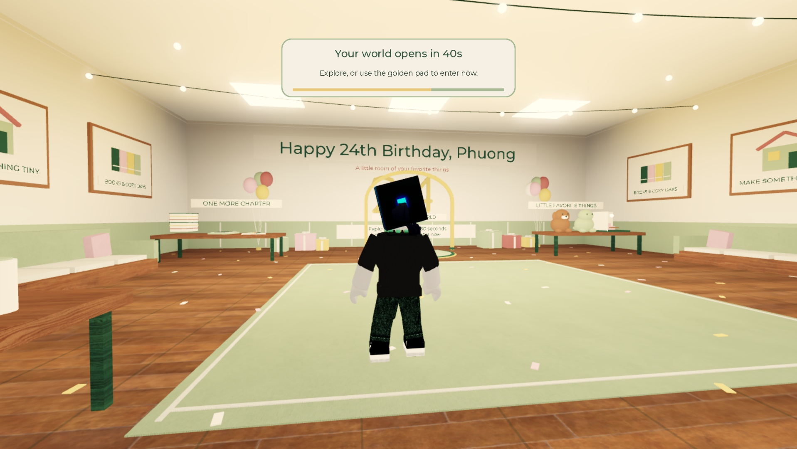
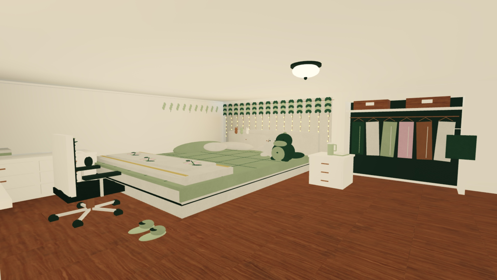
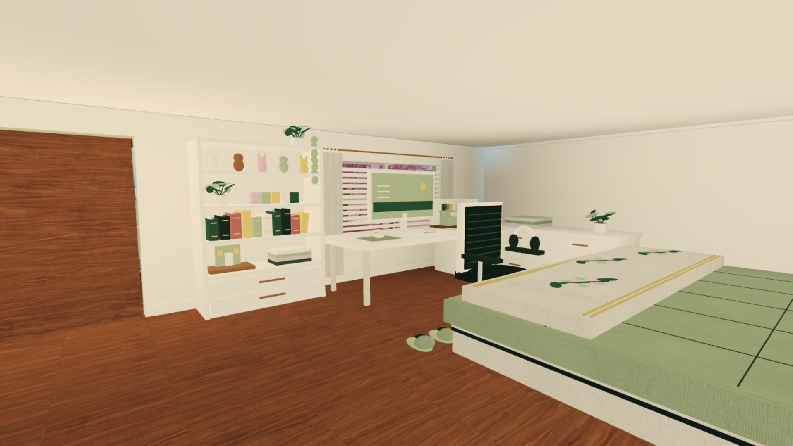
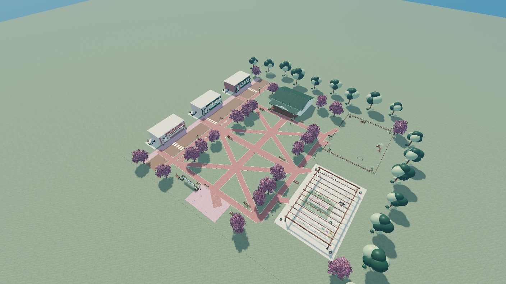
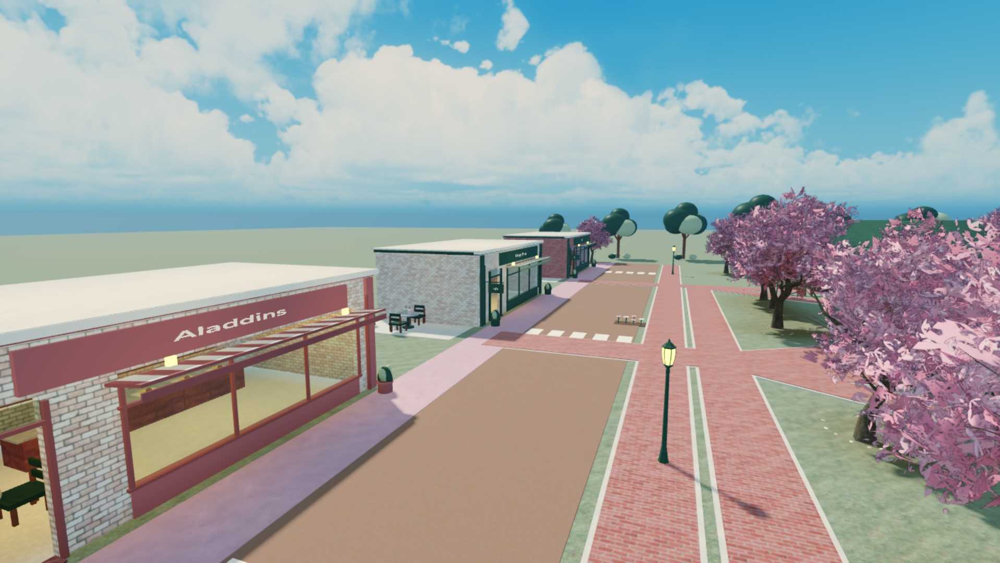
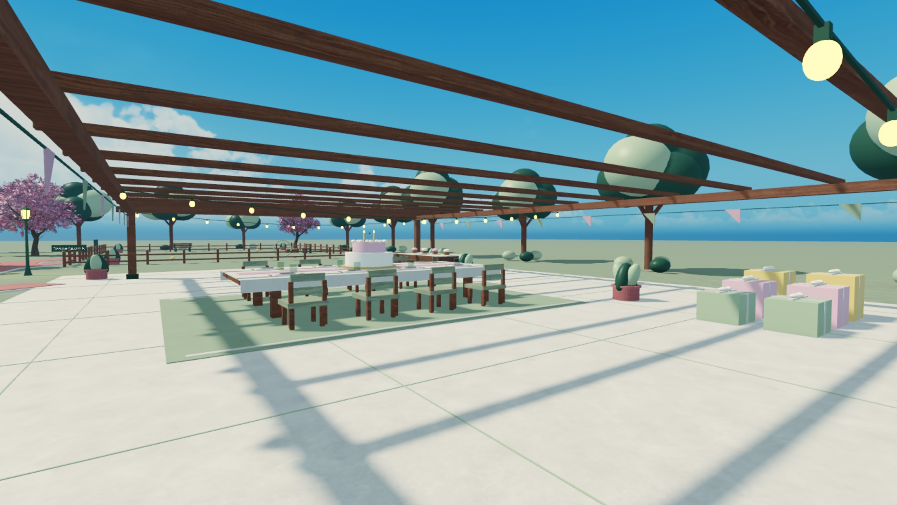
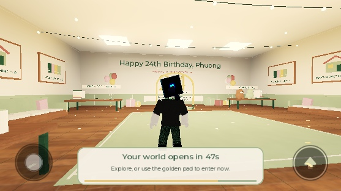
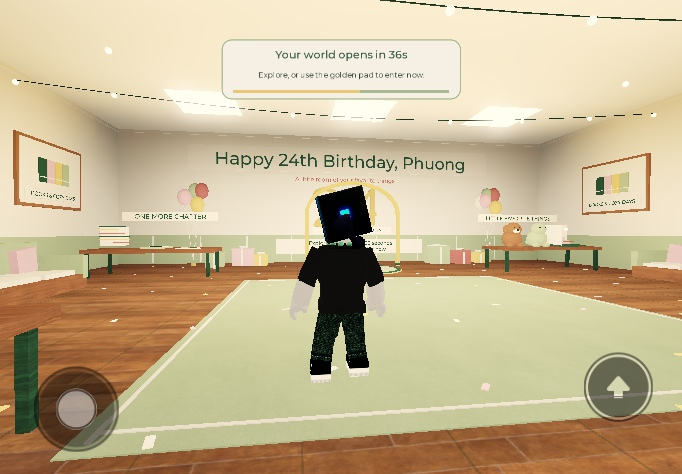

# Roblox map — Draft 02

September 26, 2026. Detailed environment and birthday-entry iteration, built in the user's existing Studio place. The greeting is **Happy 24th Birthday, Phuong**. FOB is **FOB Poke Bar**.

## What changed

- A separate enclosed birthday room is the initial spawn. It has birthday decorations, books, craft/miniature references, plush companions, tea and cake, eight seats, a large greeting and a golden entry pad. Each player receives a separate 60-second countdown; the pad allows early entry.
- The Quad has a continuous lawn, perimeter walks, a main cross and two crossed diagonal panels based on the supplied aerial photo. Brick paving is one joined network with continuous pale borders; the connectors reach the existing house, street, park and celebration area.
- The cottage contains one bedroom based on the two supplied room photos: sage bed and floral throw, padded headboard, plushies, ivy and curtain lights, white desk and shelves, monitor, chair, books and figures, shallow closet display, TV, botanical art, mirror, cart and Jasper's bed.
- The western street now has three enterable, named shops with framed glazing, awnings, projecting signs, counters, food/tea props and seating. HeyTea is between FOB Poke Bar and Aladdins. These are stylized interpretations, not exact real-world facades.
- The birthday courtyard has a timber pergola, lights and bunting, table settings for eight, cake and gifts. The park has benches, toys, a water bowl and an agility hoop. The outer trees now have branches and layered crowns.

These are editable environment objects. Store purchases, minigames, quest rewards, a moving Jasper and the final cake ceremony are future gameplay work. The personal birthday note remains entirely user-authored.

## Actual Studio views

These images show the built scene, not generated concept art.

## Source and preservation

The outdoor map retains the user's translation `(19, -0.1, -40)`. The independent lobby is at `(2000, 0, 0)` so its enclosing box is outside normal outdoor views; the destination uses the actual outdoor arrival position. The old root name `Workspace.CozyWorld_Draft01` remains stable for existing scripts.

`ServerStorage.BeforeCozyDraft02` preserves the pre-change world, authored scripts and lighting. Original community imports remain in `CozyDraftAssets.Incoming`; reviewed static templates remain in `Reviewed`. The older neighborhood geometry is preserved in `BeforeNeighborhood02`. Rejected blossom studies stay in storage and are not deployed.

Authoring order and installed script names are documented in [roblox/README.md](../roblox/README.md). The native detail pass needs no new external 3D import. The community sky, blossom mesh, benches and lanterns remain in use. The two original imported tree scripts remain disabled in storage, outside the active map.

## Verification status

The third linked automatic gates are **READY_FOR_REVIEW** for [MAP-02](../verification/runs/MAP-02/20260926T212330Z-66d9e1a6/report.md) and [PCW-17](../verification/runs/PCW-17/20260926T212331Z-c844bf5e/report.md). This is automatic readiness, not human acceptance.

The saved revision passes all **15 lobby lifecycle checks** and **nine eight-player group scenarios** in the actual Studio engine. Six visitors walked into, around and out of the bedroom at normal speed; all eight lobby and courtyard seats were occupied together. Early entry left the other seven players' countdowns, HUDs and views unchanged, and a prompt at timer expiry caused only one transition.

A separate current-source two-client desktop run confirmed independent camera rotation. Earlier camera automation failures are preserved: multiplayer test windows had retained Touch emulation, so right-mouse input was ignored. Selecting an explicit desktop profile resolved that test setup mismatch. This does not turn the earlier failed observations into passes.

The phone preview revealed a countdown panel covering the greeting. The panel now moves to the bottom center on short screens, between touch controls. Actual phone/tablet previews confirm the layout. Lowest-graphics views preserve nearby bedroom and Quad detail; distant objects fade in the aerial view. Physical-device performance is not measured.

Independent palette capture covers all 4,667 map parts, including 597 lobby parts. The approved exception preserves only the two detailed blossom-tree textures under QuadPlanting, with 21 references each. All native colors remain checked against the exact eight-color palette.

**Still pending:** physical touch completion and camera comfort, same-account reconnect, device performance, and your visual/playtest acceptance. Automated taps in the emulator did not establish touch entry; that result is explicitly unverified. Minigames, store purchases, animated Jasper and the cake ceremony remain future gameplay work.

The [independent review](draft02-independent-review.md) records defects, corrections, evidence and the current linked ticket-gate status. The [revision 03 note](draft02-revision03.md) freezes this submission. Automatic readiness is not final acceptance.

Saved in Studio and copied byte-for-byte to [Draft 02](../roblox/Phuong-Cozy-World-Draft02.rbxl). The current checkpoint is 1,624,669 bytes; its hashes and source bindings are recorded in [save-audit.json](../roblox/evidence/draft02/save-audit.json). The working file is [phuong-cozy-game.rbxl](../roblox/phuong-cozy-game.rbxl). Both are local and unpublished. The previous checkpoint is retained as `Phuong-Cozy-World-Draft02-before-responsive-hud.rbxl`.
